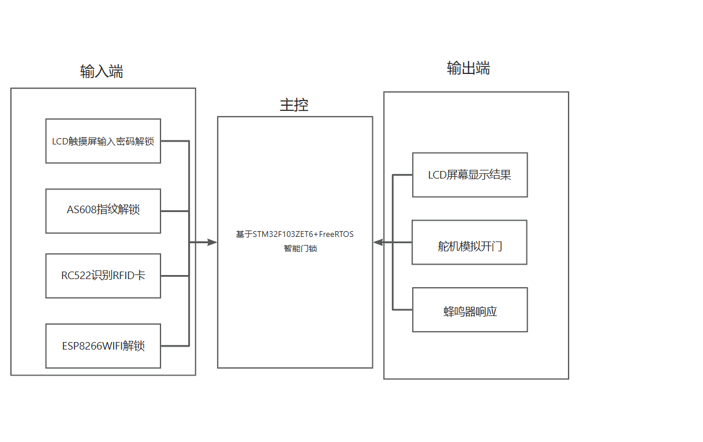
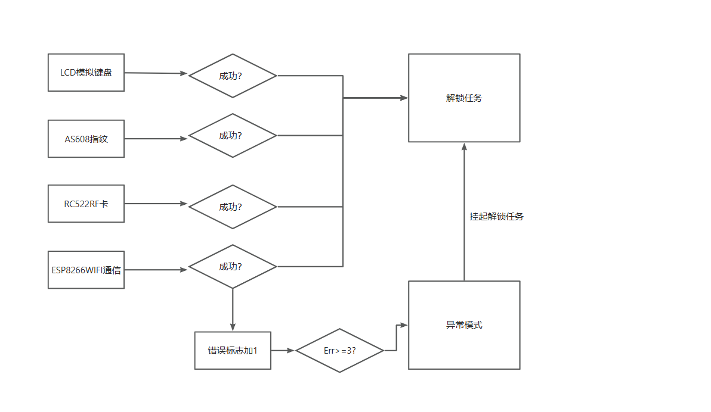
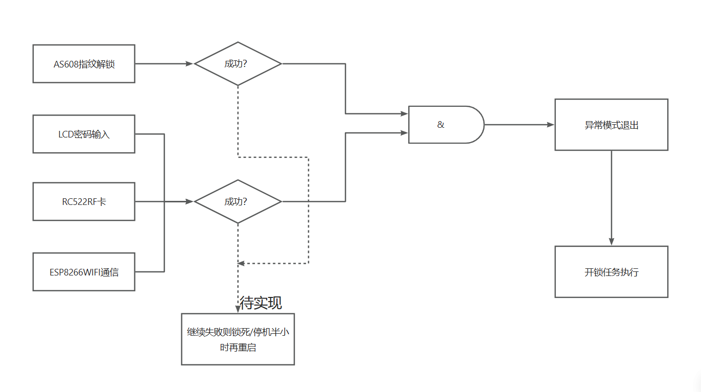

## 结构框图

## 模块&外设
* ESP8266->USART1(PA9/PA10)
* AS608->USART2(PA7/PA2-TX/PA3-RX)
* SG90 ->TIM3-CH3(PB1)
* RC522->PA4、5、6、7/PB1
* LCD

## 程序逻辑框图
### 正常模式

### 异常模式

## 难点
主要还是难在各个模块的理解上，RC522/AS608/ESP8266/LCD每一个要写出他们的初始化文件都不容易
我只记录了一个ESP8266初始化的过程，链接如下：[ESP8266](https://mp.csdn.net/mp_blog/creation/editor/136854928)

## 缺点
- 开锁的方式不够方便，应该加上一个摄像头增加一个人脸识别的功能
- 开锁任务太简单单调，如果设想真实的运用场景，或许可以打开家里的灯光、音箱等
- 异常模式的处理可以设计成只能指纹+人脸识别解锁更具安全性